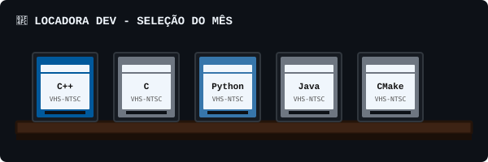

<div align="center">

  <h1 align="center">
    <code>Seja bem-vindo!</code><br>
    
  </h1>

  <a href="https://git.io/typing-svg">
    
  </a>

  <br>

  <p>🍿 ────────────────────────────────────────────────── 🍿</p>

</div>

<div align="center">
  
</div>

<div align="center">

## 🎒 INVENTÁRIO (EQUIPAMENTOS & SKILLS)

| Slot | Equipamento / Habilidade | Atributos / Efeitos |
| :---: | :--- | :---: | :--- |
| ⚔️ | **Main Hand: Laravel & PHP** | +100 Arquitetura Back-end, +85 Velocidade de Desenvolvimento |
| 🛡️ | **Off Hand: React & Tailwind** | +90 Estilização Responsiva, +80 Reatividade no Front-end |
| 🔮 | **Spellbook: Visão Computacional** | Permite conjurar modelos **YOLO** e **CNNs** para detecção em tempo real |
| 🧪 | **Potion: Elixir do Desenvolvedor** | Restaura a stamina e transforma café puro em código funcional |
| 📜 | **Active Quest: Inovação & TCC** | Missão principal da guilda: Desenvolvimento e IA aplicada |
| 🎮 | **Side Quests: Hobbys** | Busca de conquistas na Steam, sessões de RPG de mesa e produção de conteúdo |

</div>

<br>

<div align="center">

## 📜 A LORE DO AVENTUREIRO

> *"Nas terras longínguas dos códigos, um novo desenvolvedor da classe Full-Stack forja soluções através de estudo e inteligência artificial."*

```text
 _______________________________________________________________________________
/                                                                               \
|  Sempre fascinado pela criação de novos mundos — sejam eles digitais, através |
|  de linhas de código e modelos de IA, ou físicos, moldados em protótipos 3D   |
|  e tabuleiros de RPG —, o aventureiro segue explorando novas tecnologias,     |
|  enfrentando bugs e otimizando sistemas.                                       |
|                                                                               |
|  Nas horas de descanso na taverna, pode ser encontrado mestrando campanhas,    |
|  caçando conquistas raras na Steam ou discutindo clássicos do cinema.        |
\_______________________________________________________________________________/
